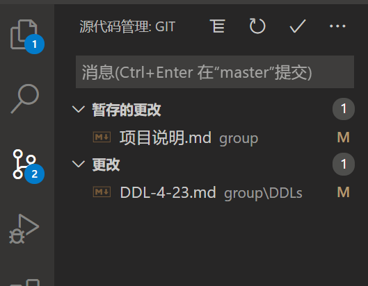

# 任务 4-19

## 分工

| 成员\得分 | 基本任务+1 |  +1   |             +2              |
| :-------: | :--------: | :---: | :-------------------------: |
|   张彬    |     √      |   √   | 提出app名字的提议, 并被采纳 |
|  王一盟   |     √      |   √   | 提出app名字的提议, 并被采纳 |
|   余佳    |   任务0    | 任务1 | 提出app名字的提议, 并被采纳 |
|  刘佳翊   |     √      |   √   | 提出app名字的提议, 并被采纳 |
|  熊逸朗   |     √      |   √   | 提出app名字的提议, 并被采纳 |

## 任务具体说明

### 任务0

1. 学习 git 用法, 推荐[这个教程](https://www.liaoxuefeng.com/wiki/896043488029600)
2. 注册 github 账号
3. 请把 github 的邮箱发给我, 我把大家添加为项目仓库的合作者, 你需要在邮箱里点一个链接确认加入
4. 完成 *3.* 之后将仓库 pull 到自己电脑, 上传一个markdown文件到 group 目录下, 命名为 ```<你的名字首字母缩写>.md``` 内容大致如下:

    <你的名字>已经加入github项目了!

    **e.g. :**

    xyl.md

    我熊某人已经加入github项目了 A.A

每次commit要**用英文**写清楚干了什么, 每完成一个 feature 就要 commit 一次!  
推荐用 vscode 来管理 git, 自带可视化的 git 系统, 相当方便, 颜值也高



### 任务1

练习 git merge

戳我一下, 告诉我你马上开始任务1

我会把你在任务0里提交的文件做一些修改, 并让你把你本地的文件做一些修改  
然后我把我的修改推送到远端  
这时候你再推送就会遇到冲突  
你得pull远端分支, 合并冲突, 重新提交  

按要求提交即可完成任务
